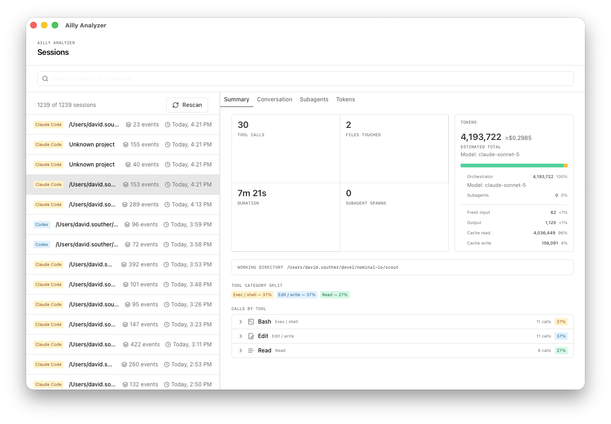

# Ailly Analyzer

See where an agent session went wrong, and where the budget went.

Ailly Analyzer is a native, local-first desktop workspace for understanding completed Claude Code, Codex, and other agent sessions. Open the sessions already on your computer, find the important moment, and move from a high-level summary to the exact tool call, file read, web request, or subagent result that shaped the outcome.



## Quickstart

With [mise](https://mise.jdx.dev) installed, clone this repo, trust it, and run `mise dev`

## What it unlocks

- Find sessions across supported local harnesses without hunting through every tool and project.
- See the shape of a session at a glance: calls, files, duration, agents, and tokens.
- Read the complete conversation in order, with tool calls and subagents available when needed.
- Investigate the sources behind a decision and trace a suspected wrong turn backward.
- Follow subagent activity as a nested, inspectable part of the parent session.
- Compare token usage, tools, files, and recurring patterns across sessions.

## Built for private work

Ailly Analyzer runs on your machine and reads existing session files after the agent is finished. It has no live harness connection, cloud account, telemetry pipeline, or write-back workflow. Source transcripts remain read-only; the local SQLite index is a rebuildable cache. Ailly Analyzer has no access to cloud-native sessions.

## Technology

The app combines a fast React and TypeScript interface with a Tauri 2 desktop shell and Rust backend. Harness adapters normalize transcript formats into an event model, while SQLite and FTS5 make large local collections searchable. Virtualized lists keep hundreds of calls navigable, and focused charts expose token and tool-use patterns without turning investigation into a wall of data.

## How it works

```text
Claude Code / Codex / other local sessions
                    |
                    v
             harness adapters
                    |
                    v
          normalized event model
                    |
                    v
         local SQLite search index
                    |
                    v
          summary, transcript, and provenance views
```

The original files remain the evidence. The index records where each event came from, so a useful discovery can lead back to the source record rather than ending at an opaque aggregate.

## Development

```sh
mise install
mise run dev
mise run check
mise run test
mise run build
```

The same workflows are available through Mise: `mise run dev`, `mise run storybook`,
`mise run check`, and `mise run build`.

The implementation roadmap lives in [.ailly/TASKS.md](.ailly/TASKS.md), and project architecture and development conventions live in [DEVELOPMENT.md](DEVELOPMENT.md).
